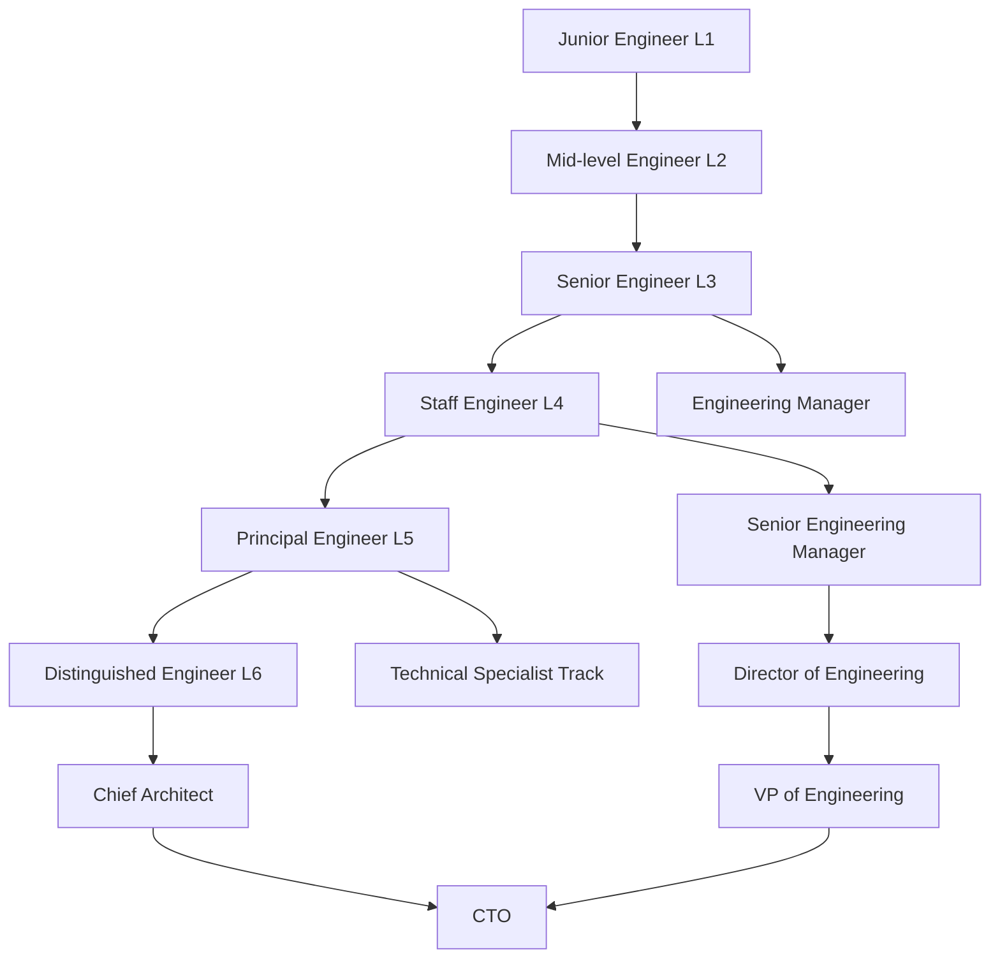

# Engineering Job Ladder Documentation

## Table of Contents
1. [Introduction](#introduction)
2. [Job Levels Overview](#job-levels-overview)
3. [Level Definitions and Self-Assessment Criteria](#level-definitions-and-self-assessment-criteria)
4. [Skills Matrix](#skills-matrix)
5. [Promotion Process](#promotion-process)
6. [Career Growth and Development Plans](#career-growth-and-development-plans)
7. [Transition Guidelines](#transition-guidelines)
8. [Regular Review Process](#regular-review-process)
9. [External Equivalency](#external-equivalency)
10. [Success Stories](#success-stories)
11. [Specialized Role Addendums](#specialized-role-addendums)
12. [Feedback and Evolution](#feedback-and-evolution)
13. [FAQ](#faq)

## 1. Introduction

This document outlines our company's engineering job ladder, providing clear, measurable criteria for each level. It serves as a comprehensive guide for engineers to self-assess their current level, understand what's needed for advancement, and plan their career growth within our organization.

## 2. Job Levels Overview

Our engineering ladder consists of six levels for individual contributors:

Junior Engineer (L1)
Mid-level Engineer (L2)
Senior Engineer (L3)
Staff Engineer (L4)
Principal Engineer (L5)
Distinguished Engineer (L6)

Note: This ladder focuses on individual contributor roles. A separate management track exists for those interested in engineering management positions (e.g., Engineering Manager, Director of Engineering, VP of Engineering). Typically, engineers at L3 (Senior Engineer) and above may be considered for management roles, depending on their interests and the organization's needs.

## 3. Level Definitions and Self-Assessment Criteria

For each level, we define specific, measurable criteria across five key dimensions:

- Technical Skills
- Project Complexity
- Leadership and Influence
- Business Impact
- Cross-functional Collaboration

Each criterion is rated on a scale of 1-5:
1. Novice
2. Advanced Beginner
3. Competent
4. Proficient
5. Expert

Engineers should aim to consistently demonstrate proficiency (level 4) in most criteria for their current level and show growth towards the next level.

### 3.1 Junior Engineer (L1)

#### Technical Skills
- [ ] Proficiency in at least one programming language (e.g., can write clean, functional code without constant guidance)
- [ ] Understanding of basic data structures and algorithms (e.g., can implement a sorting algorithm)
- [ ] Ability to write and execute unit tests for own code
- [ ] Familiarity with version control (e.g., can create branches, commit changes, and merge code in Git)

#### Project Complexity
- [ ] Successfully completes well-defined tasks within 1-2 day sprints
- [ ] Can break down a feature into coding tasks with guidance
- [ ] Debugs simple issues within own code

#### Leadership and Influence
- [ ] Actively participates in code reviews, providing and receiving feedback
- [ ] Regularly asks questions and seeks help when stuck
- [ ] Shares learnings with peers in team meetings (at least once per quarter)

#### Business Impact
- [ ] Contributes to features that directly impact team-level OKRs
- [ ] Consistently meets personal sprint commitments (>90% of the time)

#### Cross-functional Collaboration
- [ ] Effectively communicates progress and blockers in daily stand-ups
- [ ] Collaborates with QA to ensure proper testing of own code

#### Practical Examples for L1
- **Technical Skills**: Successfully implemented a new feature using the company's main programming language, such as adding form validation to a user registration page.
- **Project Complexity**: Completed a series of bug fixes for the user dashboard within a two-day sprint.
- **Leadership and Influence**: Presented a summary of a new technology learned from an online course in a team knowledge-sharing session.
- **Business Impact**: Contributed to the team's sprint goal by completing assigned tasks for a feature that improved user engagement metrics by 5%.
- **Cross-functional Collaboration**: Worked closely with a designer to implement UI changes accurately.

#### Common Scenarios and How to Handle Them (L1 to L2)
1. **Scenario**: You're asked to work on a task that seems beyond your current skills.
   **Action**: Break down the task into smaller parts. Identify which parts you can do and which parts you need help with. Approach a mid-level engineer for guidance on the challenging aspects.

2. **Scenario**: You're unsure how to approach a coding problem.
   **Action**: Start by searching the company's internal documentation and codebase for similar implementations. If you don't find a solution, formulate specific questions and ask for help in the team's chat channel or during stand-up meetings.

3. **Scenario**: You've completed your assigned tasks early in the sprint.
   **Action**: Inform your team lead and ask if there are any additional tasks you can take on. Use any extra time to review and understand other parts of the codebase or to work on your personal development goals.

### 3.2 Mid-level Engineer (L2)

#### Technical Skills
- [ ] Proficiency in multiple programming languages or frameworks used by the team
- [ ] Ability to implement complex algorithms and data structures when needed
- [ ] Writes comprehensive test suites, including integration tests
- [ ] Understands and applies design patterns appropriate to the project

#### Project Complexity
- [ ] Independently owns and delivers medium-sized features (1-2 week sprints)
- [ ] Contributes to technical design discussions, suggesting viable approaches
- [ ] Debugs complex issues that span multiple components

#### Leadership and Influence
- [ ] Mentors junior engineers, helping them with technical challenges (at least 1 junior engineer per quarter)
- [ ] Leads feature-specific technical discussions (at least 2 per quarter)
- [ ] Proposes and implements improvements to team processes (e.g., suggesting a new code review practice)

#### Business Impact
- [ ] Delivers features that noticeably improve key product metrics (with measurable impact)
- [ ] Contributes to quarterly planning, providing effort estimates for features

#### Cross-functional Collaboration
- [ ] Works effectively with product managers to refine feature requirements
- [ ] Collaborates with designers to ensure technical feasibility of proposed designs

#### Practical Examples for L2
- **Technical Skills**: Implemented a caching layer to improve the performance of a frequently accessed API endpoint, reducing response times by 50%.
- **Project Complexity**: Led the development of a new notification system, coordinating with the frontend team and completing the backend work within a two-week sprint.
- **Leadership and Influence**: Initiated and led a weekly code review session for junior engineers, improving code quality across the team.
- **Business Impact**: Proposed and implemented a feature optimization that resulted in a 10% increase in user retention for a specific user segment.
- **Cross-functional Collaboration**: Worked closely with the product team to prioritize and implement key features for a major product release.

#### Common Scenarios and How to Handle Them (L2 to L3)
1. **Scenario**: You're asked to provide effort estimates for a new feature during sprint planning.
   **Action**: Break down the feature into smaller tasks. Consider past experiences with similar work, potential roadblocks, and testing requirements. Provide a range estimate (best case/worst case) and explain your reasoning to the team.

2. **Scenario**: A junior engineer is struggling with a task you assigned them.
   **Action**: Set up a pair programming session to work through the problem together. Use this as an opportunity to teach problem-solving approaches and to gain insight into areas where the junior engineer might need additional support or training.

3. **Scenario**: You notice a pattern of technical debt accumulating in a specific area of the codebase.
   **Action**: Document the issue, including potential risks and impacts on future development. Propose a refactoring plan to your team lead, including effort estimates and potential benefits.

### 3.3 Senior Engineer (L3)

#### Technical Skills
- [ ] Expert in the primary technologies used by the team
- [ ] Designs and implements complex, scalable systems
- [ ] Leads code quality initiatives (e.g., implementing new testing frameworks, improving CI/CD pipelines)
- [ ] Stays current with industry trends, evaluating new technologies for potential adoption

#### Project Complexity
- [ ] Owns and delivers large features or small projects (1-2 month timeline)
- [ ] Breaks down complex projects into manageable tasks for the team
- [ ] Anticipates technical risks and develops mitigation strategies

#### Leadership and Influence
- [ ] Mentors mid-level engineers on technical and career growth (at least 2 engineers per year)
- [ ] Leads architectural discussions and decision-making for team projects (at least 1 major decision per quarter)
- [ ] Influences team priorities and technical direction

#### Business Impact
- [ ] Delivers projects that significantly impact company OKRs (with measurable results)
- [ ] Collaborates with product managers to shape the product roadmap
- [ ] Represents the engineering team in cross-functional meetings (at least 2 per month)

#### Cross-functional Collaboration
- [ ] Works with product and business teams to translate business requirements into technical specifications
- [ ] Collaborates with other engineering teams to ensure system-wide integration and performance

#### Practical Examples for L3
- **Technical Skills**: Designed and implemented a microservices architecture to replace a monolithic system, improving scalability and reducing deployment times by 60%.
- **Project Complexity**: Led a 2-month project to integrate a third-party payment system, coordinating efforts across frontend, backend, and DevOps teams.
- **Leadership and Influence**: Initiated and drove the adoption of a new testing framework across multiple teams, significantly improving test coverage and reliability.
- **Business Impact**: Proposed and led the development of a new feature that became a key differentiator in the market, directly contributing to a 15% increase in new user acquisition.
- **Cross-functional Collaboration**: Led a task force with product, design, and marketing teams to revamp the user onboarding process, resulting in a 25% increase in user activation rates.

#### Common Scenarios and How to Handle Them (L3 to L4)
1. **Scenario**: You're asked to evaluate and recommend a new technology stack for an upcoming project.
   **Action**: Conduct a thorough analysis of potential technologies, considering factors like scalability, community support, and alignment with company goals. Present your findings and recommendations to both the engineering team and stakeholders, clearly outlining pros and cons.

2. **Scenario**: There's disagreement within the team about the best architectural approach for a new system.
   **Action**: Facilitate a technical design review meeting. Encourage all team members to present their ideas. Guide the discussion towards a consensus by focusing on objective criteria (e.g., performance, maintainability, alignment with company tech strategy).

3. **Scenario**: A critical production issue is reported outside of normal business hours.
   **Action**: Take the lead in coordinating the response. Quickly assess the severity and impact of the issue. Assemble a team if necessary, delegate tasks, and keep stakeholders informed of progress. After resolution, lead a post-mortem to prevent similar issues in the future.

### 3.4 Staff Engineer (L4)

#### Technical Skills
- [ ] Recognized as a subject matter expert in multiple technical domains
- [ ] Designs complex distributed systems that scale to millions of users
- [ ] Introduces new technologies or frameworks that improve overall engineering productivity
- [ ] Authors technical RFCs that guide major architectural decisions (at least 2 per year)

#### Project Complexity
- [ ] Leads major multi-month or multi-team projects (at least 1 per year)
- [ ] Defines technical strategy for a product area or domain
- [ ] Solves novel technical problems with company-wide impact

#### Leadership and Influence
- [ ] Mentors senior engineers and tech leads (at least 3 per year)
- [ ] Drives technical decisions that impact multiple teams
- [ ] Influences company-wide engineering standards and practices

#### Business Impact
- [ ] Delivers technical solutions that open new business opportunities (with quantifiable results)
- [ ] Contributes to the long-term technical roadmap (1-2 years out)
- [ ] Identifies and leads initiatives to address top technical challenges facing the company

#### Cross-functional Collaboration
- [ ] Partners with product leadership to align technical strategy with business goals
- [ ] Collaborates with other departments (e.g., data science, operations) to drive company-wide initiatives

#### Practical Examples for L4
- **Technical Skills**: Architected a new data processing pipeline capable of handling petabytes of data, enabling real-time analytics for the entire product suite.
- **Project Complexity**: Led a 6-month, cross-functional project to completely overhaul the company's API infrastructure, improving developer productivity by 40% and enabling new partner integrations.
- **Leadership and Influence**: Established a company-wide technical mentorship program, pairing senior engineers with junior and mid-level engineers across different teams.
- **Business Impact**: Identified and led the development of a new machine learning-based feature that became a major selling point for enterprise customers, directly contributing to a 25% increase in enterprise revenue.
- **Cross-functional Collaboration**: Worked with the data science team to implement a new recommendation engine, increasing user engagement by 30% across all product lines.

#### Common Scenarios and How to Handle Them (L4 to L5)
1. **Scenario**: The company is considering a major strategic shift in its technology stack.
   **Action**: Lead a comprehensive analysis of the proposed change. Consider technical, business, and organizational impacts. Prepare a detailed report for executive leadership, including implementation strategy, risk assessment, and long-term implications.

2. **Scenario**: There's a need to improve collaboration and knowledge sharing across multiple engineering teams.
   **Action**: Design and implement a cross-team architecture review process. Organize regular tech talks and workshops. Create a centralized knowledge base for sharing best practices and lessons learned.

3. **Scenario**: The engineering organization is struggling with technical debt across multiple systems.
   **Action**: Develop a company-wide technical debt reduction strategy. Prioritize areas for improvement based on business impact. Create a roadmap for addressing these issues, balancing with ongoing product development needs.

### 3.5 Principal Engineer (L5)

#### Technical Skills
- [ ] Demonstrates deep expertise across multiple technical domains critical to the company's success
- [ ] Pioneers the adoption of new technologies that give the company a competitive edge
- [ ] Creates architectural patterns that are reused across the organization

#### Project Complexity
- [ ] Leads multi-year technical strategies
- [ ] Solves the most complex technical challenges facing the organization
- [ ] Defines how multiple systems interact across the entire technical stack

#### Leadership and Influence
- [ ] Serves as a technical advisor to senior leadership, including C-level executives
- [ ] Mentors staff engineers and senior technical leaders (at least 5 per year)
- [ ] Influences the broader technical community outside the company (e.g., through conference talks, blog posts)

#### Business Impact
- [ ] Drives technical decisions that fundamentally impact the company's long-term success
- [ ] Identifies new market opportunities enabled by technical innovations
- [ ] Leads technology due diligence for potential acquisitions

#### Cross-functional Collaboration
- [ ] Works closely with executives to align technology strategy with overall business strategy
- [ ] Collaborates with external partners and customers on strategic technical initiatives

#### Practical Examples for L5
- **Technical Skills**: Developed a proprietary algorithm that became the core of the company's competitive advantage, significantly outperforming industry benchmarks by 200%.
- **Project Complexity**: Led a 3-year initiative to transition the entire company infrastructure to a cloud-native, globally distributed architecture, enabling rapid scaling and entering 5 new international markets.
- **Leadership and Influence**: Represented the company at major tech conferences, establishing it as a thought leader in distributed systems and attracting top talent, resulting in a 30% increase in job applications for senior roles.
- **Business Impact**: Identified an emerging technology trend and led the development of a new product line, which grew to contribute 30% of the company's revenue within two years.
- **Cross-functional Collaboration**: Partnered with the CEO and CFO to develop a 5-year technology investment strategy, aligning engineering efforts with long-term business goals.

#### Common Scenarios and How to Handle Them (L5 to L6)
1. **Scenario**: The company needs to make a strategic decision between building a critical technology in-house or acquiring a company that already has the technology.
   **Action**: Lead a comprehensive analysis considering technical capabilities, market position, long-term strategy, and financials. Present findings and recommendations to the board of directors, outlining short-term and long-term implications of each option.

2. **Scenario**: The engineering organization is struggling to attract and retain top talent in a competitive market.
   **Action**: Develop a multi-faceted strategy to enhance the company's technical brand. This might include establishing an open-source program, creating a distinguished engineer track, and developing partnerships with top universities.

3. **Scenario**: The company is facing a major technological disruption in its industry.
   **Action**: Lead the formation of a cross-functional innovation task force. Develop multiple scenarios for how the disruption might play out. Create strategic technical roadmaps for each scenario, ensuring the company is prepared to pivot quickly if needed.

### 3.6 Distinguished Engineer (L6)

#### Technical Skills
- [ ] Internationally recognized expert in one or more technical domains
- [ ] Invents new technologies or techniques that advance the state of the art in the industry
- [ ] Authors patents or foundational academic papers in their area of expertise (at least 1 per year)
- [ ] Drives adoption of cutting-edge technologies across the entire organization and beyond

#### Project Complexity
- [ ] Defines the long-term technical vision for the entire company (3-5 year horizon)
- [ ] Leads transformative, multi-year initiatives that reshape the industry
- [ ] Solves technical challenges that have stumped other top experts in the field
- [ ] Architects systems that fundamentally change how the company operates

#### Leadership and Influence
- [ ] Serves as the face of the company's technical brand, speaking at top-tier conferences (at least 3 per year) and engaging with industry leaders
- [ ] Mentors principal engineers and influences the career growth of engineers across the organization (mentoring at least 10 senior leaders per year)
- [ ] Shapes technical standards and best practices at an industry level
- [ ] Represents the company in standards bodies and industry consortiums

#### Business Impact
- [ ] Drives technical innovations that create new markets or business models
- [ ] Influences product and business strategy at the highest levels of the company
- [ ] Attracts world-class talent to the organization through their reputation and vision
- [ ] Contributes to major business decisions that significantly impact company valuation

#### Cross-functional Collaboration
- [ ] Works directly with the C-suite to shape company-wide strategy
- [ ] Collaborates with academic institutions on research initiatives
- [ ] Engages with customers, partners, and competitors at the highest levels to influence industry direction

#### Practical Examples for L6
- **Technical Skills**: Invented a new distributed consensus algorithm that was adopted by multiple major tech companies and became the subject of computer science courses at top universities.
- **Project Complexity**: Led a 5-year moonshot project that resulted in a breakthrough in quantum computing, positioning the company as a leader in an entirely new market valued at $10 billion.
- **Leadership and Influence**: Served on advisory boards for multiple top-tier universities and tech companies, shaping the future direction of computer science education and industry standards.
- **Business Impact**: Pioneered the company's expansion into a new, adjacent market, which grew to become the company's primary revenue source within 3 years, increasing overall company revenue by 150%.
- **Cross-functional Collaboration**: Co-authored a white paper with the CEO outlining the company's vision for the future of technology, which was widely cited in industry publications and influenced government policy on tech regulation.

#### Common Scenarios and How to Handle Them (L6)
1. **Scenario**: A major competitor announces a technological breakthrough that threatens your company's market position.
   **Action**: Conduct a rapid, deep analysis of the competitor's technology. Convene a task force of top engineers and researchers to explore potential responses. Present a comprehensive strategy to the board, including options for leapfrogging the competitor's technology, potential acquisitions or partnerships, and implications for the company's long-term strategy.

2. **Scenario**: The company is considering a major pivot in its core technology stack that would affect all products and services.
   **Action**: Lead a company-wide technical assessment of the proposed pivot. Analyze short-term costs against long-term benefits. Create a detailed transition plan, including risk mitigation strategies. Present findings to the board and executive team, providing a clear recommendation with supporting evidence.

3. **Scenario**: There's an opportunity to establish a new industry standard that could give your company a significant advantage.
   **Action**: Form a coalition with other industry leaders to propose and develop the new standard. Lead the technical aspects of the standard's development. Simultaneously, work with your company's engineering teams to ensure you're positioned to quickly implement and benefit from the new standard once it's established.

### Non-Technical Skills Emphasis

For each level, we also evaluate the following non-technical skills:

- Communication: Ability to express ideas clearly and listen effectively
- Project Management: Skill in planning, executing, and closing projects
- Mentoring: Capacity to guide and develop others
- Problem-solving: Aptitude for tackling complex issues creatively
- Adaptability: Flexibility in the face of changing technologies and priorities

These skills become increasingly important as you progress up the ladder.

## 4. Skills Matrix

Below is a visual representation of the key skills required at each level. Use this matrix to quickly assess your current position and identify areas for growth.

| Skill Area | L1 (Junior) | L2 (Mid) | L3 (Senior) | L4 (Staff) | L5 (Principal) | L6 (Distinguished) |
|------------|-------------|----------|--------------|------------|-----------------|---------------------|
| Technical Proficiency | 2-3 | 3-4 | 4-5 | 5 | 5 | 5 |
| System Design | 1-2 | 2-3 | 3-4 | 4-5 | 5 | 5 |
| Project Complexity | 1-2 | 2-3 | 3-4 | 4-5 | 5 | 5 |
| Leadership | 1 | 1-2 | 2-3 | 3-4 | 4-5 | 5 |
| Business Impact | 1 | 1-2 | 2-3 | 3-4 | 4-5 | 5 |
| Cross-functional Collaboration | 1 | 1-2 | 2-3 | 3-4 | 4-5 | 5 |
| Communication | 2-3 | 3 | 3-4 | 4 | 4-5 | 5 |
| Mentoring | 1 | 1-2 | 2-3 | 3-4 | 4-5 | 5 |

Scale: 1 (Novice), 2 (Advanced Beginner), 3 (Competent), 4 (Proficient), 5 (Expert)

## 5. Promotion Process

1. Self-assessment: Use the criteria above to evaluate your current level and readiness for promotion. Rate yourself on each criterion using the 1-5 scale provided.

2. Evidence collection: Document specific examples of how you've met the criteria for your target level. Include quantifiable results where possible.

3. Manager review: Discuss your self-assessment and evidence with your manager during your quarterly career development conversations.

4. Peer feedback: Collect feedback from at least 3-5 colleagues (including those from other departments for higher levels) who can speak to your contributions.

5. Promotion committee: A panel of senior engineers and leaders will review your case. This committee meets bi-annually (June and December).

Promotion decisions are based on consistently demonstrating the skills and impact of the next level for a sustained period (typically 6-12 months).

## 6. Career Growth and Development Plans

To help engineers progress through the ladder, we've created specific development plans for each level transition. These plans include:

- Key skills to focus on
- Recommended projects or responsibilities to take on
- Learning resources (books, courses, conferences)
- Mentorship opportunities

[Note: The development plans for each level transition (L1 to L2, L2 to L3, etc.) would be included here, following the format provided in the original document.]

## 7. Transition Guidelines

The following guidelines can help you assess your readiness for transition to the next level:

### L1 to L2
- Consistently deliver features independently
- Proactively identify and fix bugs across the codebase
- Regularly contribute to code reviews
- Take on mentoring responsibilities for new team members or interns

### L2 to L3
- Lead the design and implementation of medium-sized features
- Consistently provide valuable technical input in team discussions
- Mentor junior engineers effectively
- Demonstrate impact on team-level OKRs

### L3 to L4
- Successfully lead large, multi-month projects
- Influence technical decisions across multiple teams
- Consistently mentor other senior engineers
- Drive initiatives that have company-wide impact

### L4 to L5
- Define and execute on multi-year technical strategies
- Recognized as a go-to person for critical technical decisions
- Consistently influence product strategy based on technical insights
- Lead initiatives that open new business opportunities

### L5 to L6
- Drive industry-wide technical innovations
- Represent the company as a thought leader in external technical communities
- Influence company-wide strategy at the executive level
- Lead initiatives that create new markets or business models

## 8. Regular Review Process

We encourage engineers to review their position on the ladder with their manager on a quarterly basis. These reviews should align with our regular performance review cycle but provide a more focused look at career development.

To prepare for these reviews:
1. Self-assess your skills using the criteria and skills matrix provided
2. Gather concrete examples of your impact and growth since the last review
3. Identify areas where you'd like to grow and potential projects that could provide that growth
4. Come prepared with questions about your career path and development opportunities

## 9. External Equivalency

While every company's ladder is unique, here's a rough guide to how our levels might compare to other tech companies:

- L1 (Junior): Entry-level positions at most companies
- L2 (Mid): SDE II at Amazon, Software Engineer II at Google
- L3 (Senior): Senior SDE at Amazon, Senior Software Engineer at Google
- L4 (Staff): Principal SDE at Amazon, Staff Software Engineer at Google
- L5 (Principal): Senior Principal SDE at Amazon, Senior Staff Software Engineer at Google
- L6 (Distinguished): Distinguished Engineer at Amazon, Principal Engineer at Google

Note that these are approximate comparisons and may vary based on specific roles and responsibilities.

## 10. Success Stories

Here are a few anonymized examples of engineers who have successfully navigated our career ladder:

1. "Alex" - L1 to L3 in 4 years:
   Started as a fresh graduate, quickly picked up our tech stack, led the redesign of our authentication system as an L2, and earned promotion to L3 after successfully leading a critical performance optimization project.

2. "Sam" - L3 to L5 in 6 years:
   Joined as a Senior Engineer from another company, established our SRE practices, led the company's cloud migration as an L4, and achieved L5 after pioneering our machine learning infrastructure, opening up new product possibilities.

3. "Jordan" - Alternative path to L5:
   Began at L2, chose to deep-dive into distributed systems rather than taking on people management. Became our go-to expert for all things distributed, authored several influential internal design docs, and reached L5 as a Technical Specialist.

## 11. Specialized Role Addendums

While the main ladder applies to all engineering roles, we recognize that some positions require specialized skills. Here are brief addendums for common specialized roles:

### Frontend Engineers
- Additional focus on UI/UX best practices
- Emphasis on performance optimization for client-side applications
- Expertise in accessibility standards

### Backend Engineers
- Strong focus on system design and scalability
- Emphasis on data modeling and database optimization
- Expertise in API design and microservices architecture

### DevOps Engineers
- Focus on infrastructure as code and automation
- Emphasis on monitoring, alerting, and incident response
- Expertise in containerization and orchestration technologies

### Machine Learning Engineers
- Strong foundation in statistics and mathematical modeling
- Emphasis on data pipeline design and large-scale data processing
- Expertise in ML model development, training, and deployment

## 12. Feedback and Evolution

This job ladder is a living document that should evolve with our organization. We encourage all engineers to provide feedback on its effectiveness and relevance. If you have suggestions for improvements:

1. Discuss your ideas with your manager during your regular 1:1s
2. Submit your suggestions to the Engineering Career Development Committee via our internal feedback form
3. Participate in our annual engineering survey, which includes questions about the career ladder

We review all feedback and update the ladder annually to ensure it continues to serve the needs of our engineering organization.

## 13. FAQ

[Content remains the same as in the previous version, with the addition of the following question]

Q: How can I visualize my career progression?

A: Here's a simplified flowchart of potential career paths within our engineering organization:

This chart shows both the individual contributor path (ending at Distinguished Engineer or Chief Architect) and the management path (ending at VP of Engineering or CTO). The Technical Specialist track is an alternative path for those who want to deepen their expertise without taking on increased management responsibilities.

Remember, these paths are flexible, and it's possible to move between IC and management roles as your career evolves.
